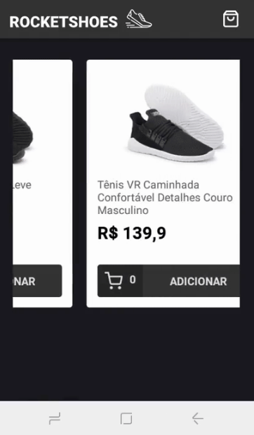

INTERFACE PARA UM APLICATIVO DE VENDAS DE TÊNIS/SAPATOS 

>Pequeno app desenvolvido com o objetivo de aprimorar o conhecimento sobre **React Native** e **Redux**.

Esse **app** simula uma pequena loja de tênis/sapatos. O funcionamento dele pode ser vista abaixo:




***OBS:*** Caso queria testar o app, o mesmo não possui API própria, por isso foi utilizado o [json-server](https://github.com/typicode/json-server) para simular uma API REST. Basta instalar o json-server (globalmente ou como dependência de desenvolvimento) e depois executar esse simples comando na raiz do projeto:

```
json-server --host 192.168.0.8 --port 3333 api.json
```

